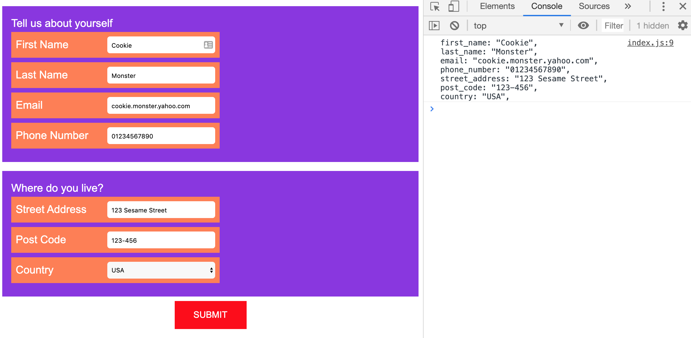

# Form in React

## Requirements

- app to read from config.json, information about form structure
- flexible to render differemt input types, labels, forms with form group
- output data in console.log in set format after form submission

## Installation

- `git clone ****` project locally
- `cd form-react` change into folder
- `npm i` to install all dependencies
- `npm run start` to start in parallel Express and Front End app
- visit `localhost:3030` to see app

## Technology used

- React, hooks (useState, useEffect, useContext, useReducer)
- ES6 e.g. map, filter, arrow functions, template strings
- CSS, BEM, Sass, Flexbox
- Parcel.js for bundling

## Comments (to be completed)

- output to have keys e.g. firstName not first_name

## Screenshots

